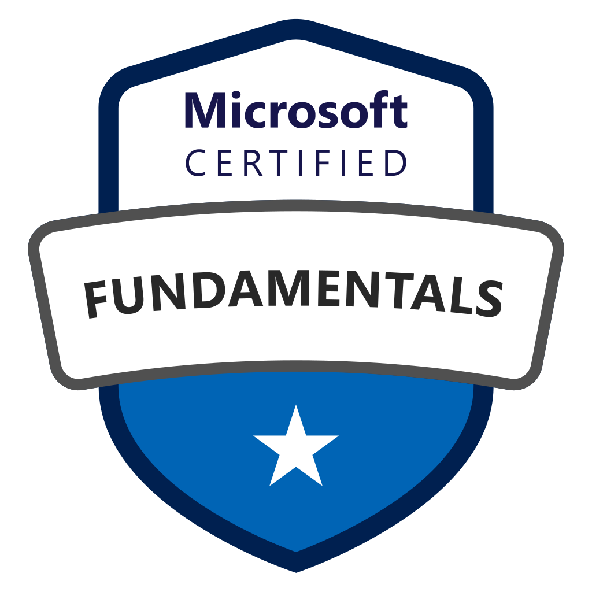
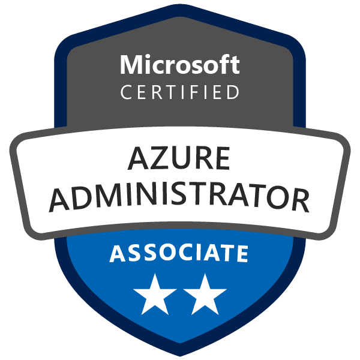

# Hi all there!

Welcome to my GitHub profile! I am a **DevOps/SRE professional** with a passion for automation, cloud infrastructure, and continuous improvement. I am particularly interested in **FinOps, automating processes, security, containerization, and cloud technologies**.

## Connect with Me

## Certifications

Here are some of the certifications I hold:

  
  
  
  
  
  
  
  
  
  
  
  
  
  
  

<!-- Add more certifications as needed -->

